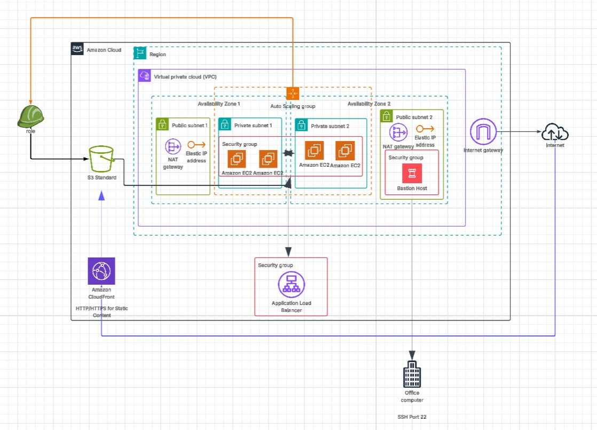
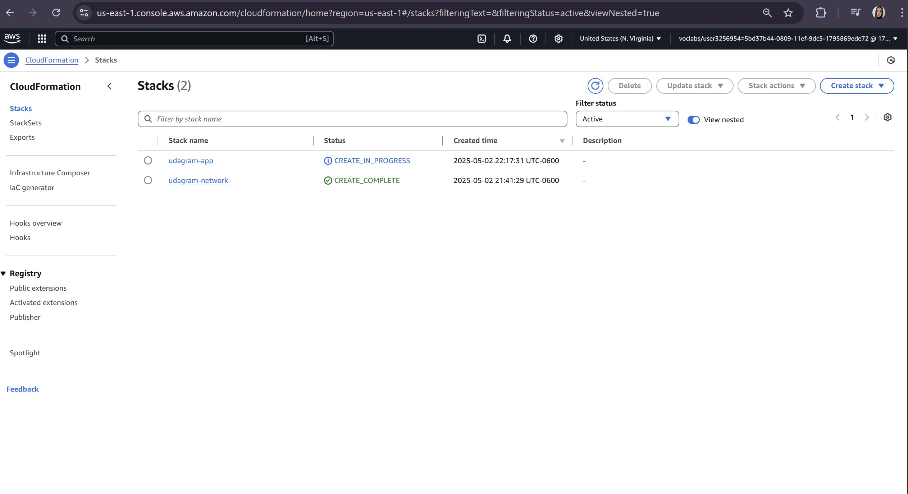

# Almagram - Instagram Clone on AWS



## Project Overview

This project implements a high-availability deployment for "Almagram", an Instagram-like application, using AWS CloudFormation for Infrastructure as Code (IaC). The infrastructure is designed with fault tolerance and scalability in mind, following AWS best practices.

## Project Highlights

- ✅ **Infrastructure as Code**: Complete AWS infrastructure defined using CloudFormation
- ✅ **High Availability Design**: Multi-AZ deployment with load balancing
- ✅ **Security Best Practices**: Proper network segmentation and least privilege principles
- ✅ **Modern UI**: Custom designed Instagram-like interface
- ✅ **Content Delivery Optimization**: CloudFront integration for static assets

## Technologies Used

- **AWS CloudFormation**: Infrastructure as Code for all cloud resources
- **Amazon VPC**: Network isolation with public and private subnets
- **Amazon EC2**: Compute resources with Auto Scaling
- **Elastic Load Balancing**: Application load balancer for traffic distribution
- **Amazon S3**: Storage for static web assets
- **Amazon CloudFront**: Content delivery network
- **AWS IAM**: Identity and access management for secure resource access

## Project Structure

The project is structured into the following folders:

* `templates`: Contains the CloudFormation templates for the infrastructure.
* `parameters`: Contains parameter files for the CloudFormation templates.
* `scripts`: Contains scripts for automating the deployment and teardown of the CloudFormation stacks.
* `images`: Contains diagrams and screenshots of the infrastructure.

## Deployment Instructions

To deploy the Almagram infrastructure (previously named "Udagram", then renamed "Almagram), follow these steps:

1. Clone this repository to your local workspace.
2. Review the CloudFormation templates in the `templates` folder and parameter files in the `parameters` folder.
3. Make any necessary adjustments to the templates or parameter files based on your requirements.
4. Navigate to the `scripts` folder and use the `run.sh` script for deployment:

   ```bash
   # To create stacks
   ./run.sh create
   
   # To deploy using change sets (recommended for production)
   ./run.sh deploy
   
   # To update stacks
   ./run.sh update
   
   # To delete stacks
   ./run.sh delete
   ```

The `run.sh` script is the primary tool used to manage the entire infrastructure lifecycle, handling the creation, updating, and deletion of both the network and application stacks in the correct order. The `deploy` command is particularly useful as it maintains change sets, allowing you to review the proposed changes before they are applied - a best practice for production environments.

Alternatively, individual stack scripts are also available:

```bash
# Deploy individual stacks
./create.sh udagram-network ../templates/network.yml ../parameters/network-parameters.json
./create.sh udagram-app ../templates/udagram.yml ../parameters/udagram-parameters.json

# Update individual stacks
./update.sh udagram-network ../templates/network.yml ../parameters/network-parameters.json
./update.sh udagram-app ../templates/udagram.yml ../parameters/udagram-parameters.json

# Delete individual stacks
./delete.sh udagram-app
./delete.sh udagram-network
```

## Architecture Design

The Almagram application is built on a resilient architecture that includes:

* **VPC with Public and Private Subnets**: Network isolation with public subnets for load balancers and private subnets for application servers
* **NAT Gateways**: Allowing outbound internet access for instances in private subnets
* **Auto Scaling Group**: Spanning multiple Availability Zones for high availability
* **Application Load Balancer**: Distributing traffic across the auto-scaling group
* **S3 Bucket**: Storing static assets with proper access controls
* **CloudFront Distribution**: Globally distributed content delivery
* **IAM Roles and Security Groups**: Principle of least privilege for secure operations

## Implementation Results



The above image shows the successfully deployed CloudFormation stacks in the AWS Management Console.

## CloudFormation Design

### Template Separation

The infrastructure is divided into two separate CloudFormation templates:

1. **Network Template** (`network.yml`): Contains all networking resources including VPC, subnets, Internet Gateway, NAT Gateways, and route tables. This separation follows the industry best practice where network infrastructure is typically managed by a dedicated network team.

2. **Application Template** (`udagram.yml`): Contains application-specific resources such as EC2 instances, Auto Scaling Group, Load Balancer, S3 bucket, IAM roles, and CloudFront distribution.

### Cross-Stack References

The application stack references resources from the network stack using CloudFormation exports and imports. This approach:

- Maintains proper separation of concerns
- Allows independent updates to network and application stacks
- Enforces proper resource dependencies

For example, the application template imports VPC and subnet IDs from the network stack using code like:

```yaml
VpcId:
  Fn::ImportValue:
    !Sub "${ProjectName}-vpc-id"
```

### Output Exports

Both templates export key resource identifiers for cross-stack references. The application stack exports public URLs including:

- The Load Balancer URL with `http://` prefix for immediate access
- The CloudFront distribution URL for accessing static content

These exports make it easy to access the application after deployment without having to navigate through the AWS Console.

## Technical Challenges and Solutions

During the development of this project, I encountered and solved several technical challenges:

1. **Cross-Stack References**: Implemented export/import functionality between network and application stacks to maintain separation of concerns.

2. **Instance Bootstrapping**: Created a comprehensive user data script to configure EC2 instances with the application and its dependencies.

3. **S3 Content Permissions**: Configured proper bucket policies to securely serve content to users while maintaining appropriate access controls.

## Future Improvements

The following enhancements are planned for future iterations of this project:

* **Personal Photo Integration**: Currently, the code attempts to upload and display a personal photo as one of the feed items. While the upload to S3 is successful (verified by S3 console), there are display issues with the image in the front-end application. This will be resolved by investigating the variable substitution mechanism in the CloudFormation templates.

* **Database Integration**: Add a proper database backend (such as RDS or DynamoDB) for storing user information and post metadata.

* **User Authentication**: Implement user authentication via Amazon Cognito to allow for secure user login and registration.

* **CI/CD Pipeline**: Implement a full CI/CD pipeline using AWS CodePipeline and AWS CodeBuild for automated deployments.

* **Monitoring and Alerts**: Add CloudWatch alarms and dashboards for monitoring the infrastructure.

## Getting Started

### Prerequisites

1. AWS CLI installed and configured with an IAM user having appropriate permissions
2. Git installed on your local machine
3. Basic knowledge of AWS CloudFormation and cloud infrastructure

### Dependencies

1. AWS CLI installed and configured in your workspace using an AWS IAM role with Administrator permissions.

2. Access to a diagram creator software of your choice. I used [LucidChart](https://www.lucidchart.com/pages) for the infrastructure diagrams.
 
3. Your favorite IDE or text editor ready to work. I used [Visual Studio](https://visualstudio.microsoft.com/vs/).

### Installation

You can get started by cloning this repo in your local workspace:

```bash
git clone https://github.com/almasoriaw/almagram-app-devops.git
cd almagram-app-devops
```

## Testing

Manual testing was performed to ensure:

1. Infrastructure deployment and teardown works correctly
2. Web servers are properly bootstrapped with the application
3. Load balancer health checks pass for all instances
4. Static content is correctly served from S3 via CloudFront

No automated tests are required for this project.

## Key Learnings

Developing this project has provided valuable experience in:

- Designing resilient and scalable cloud architectures
- Implementing Infrastructure as Code principles
- Managing complex AWS resource dependencies
- Automating deployment and configuration processes
- Applying security best practices in cloud environments

These skills are directly applicable to real-world enterprise cloud deployments and modern DevOps practices.

## License

[License](LICENSE.txt)
